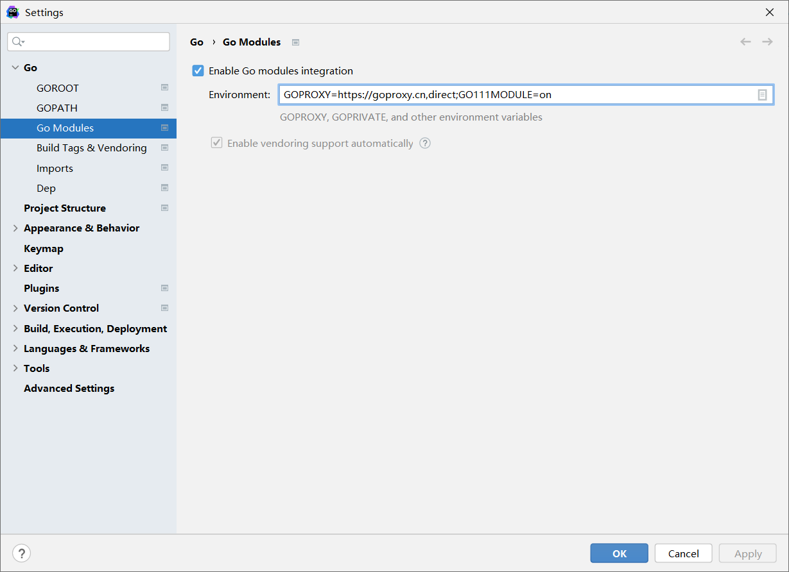
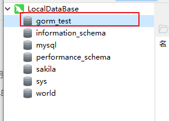
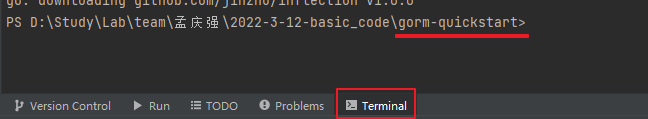
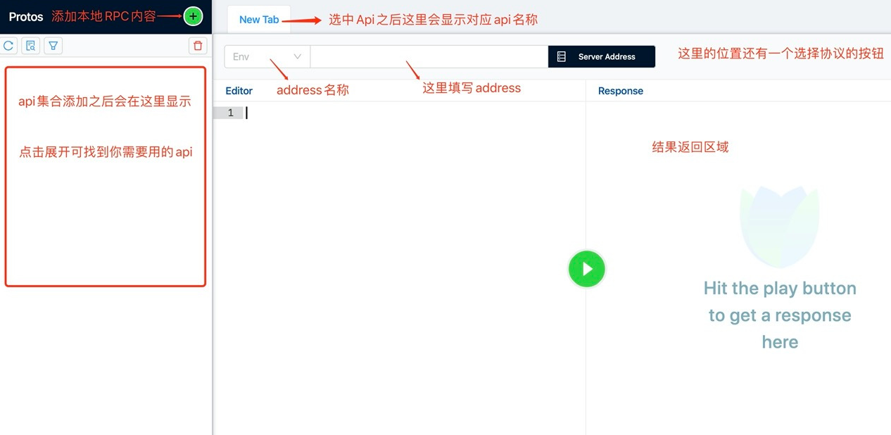
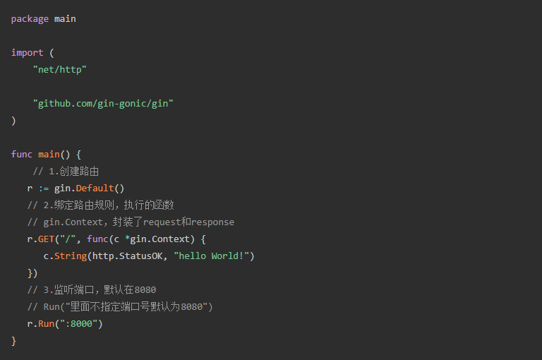
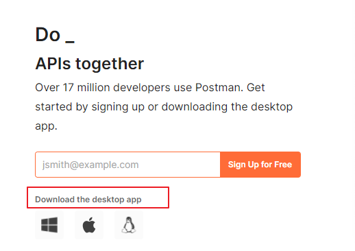
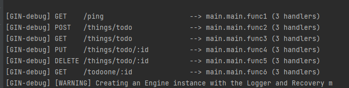
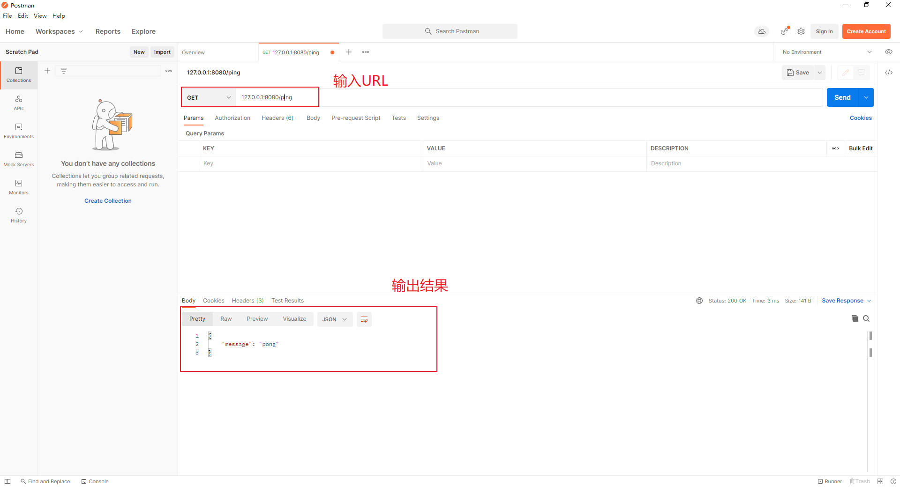

## 介绍

本部分内容从实战角度介绍系统开发中需要学习的几个技术。

### 环境配置
1. 下载go安装包和go语言的IDE

可以用vscode+插件的方式，也可以下载GoLand（类似pycharm）
地址说明：https://www.jb51.net/article/197314.htm

2. GoLand配置

   1、如果之前装有Goland版本, 可以先删除掉, 再重新安装
   2、到官网下载Goland安装包
   https://www.jetbrains.com/zh-cn/go/download/other.html
   选择2021-2-2的版本
   具体破解操作见教程，2022年Goland最新破解教程 - SegmentFault 思否
   破解版的插件（使用它可以无限重置30天，永不到期！）
   链接：
   https://pan.baidu.com/s/13s9-lFY61-3ZsNjrE4Lp9Q 
   提取码：yyds

3. Goland项目准备
    进入项目后，第一步就是先选择国内代理源，便于下载各种依赖
    在左上角file工具栏中选择setting，选择go设置Go Module
    
            

### Step 0 go语言基础
Go语言简介可先查看该教程网站
http://c.biancheng.net/golang/intro/
网站中某些需要付费才能看的标题可以直接复制标题去百度，即可查看相关资料

### Step 1 如何通过gorm调用 mysql 
https://gorm.io/docs/#Quick-Start

1. 本地MySQL数据库准备
1.1 创建本地MySQL数据库，如果没有配置过可以查看如下教程
https://www.cnblogs.com/winton-nfs/p/11524007.html
创建数据库名字为gorm_test

2.1 可以下载 Navicat 等数据库管理工具，可以便捷查看MySQL数据库内容变更，也可便于之后查看mangoDB的相关数据。如果没有配置过可以查看如下教程：
https://cloud.tencent.com/developer/article/1804255
       


2. 使用Goland打开工程目录gorm-quickstart
2.1 Goland的项目准备，先添加国内代理

3. 下载对应依赖
    3.1 在Terminal中进入gorm-quickstart界面
     

  3.2 输入go mod init生成go依赖文件go.mod
  3.3 输入go mod tidy安装对应依赖包。
  注如果出现了A connection attempt failed because the connected party did not properly respond  after a period of time, or established connection failed because connected host has failed to respond.的问题
  解决方法：改成我们国内可用的代理地址
  在命令提示符输入： go env -w GOPROXY=https://goproxy.cn
  3.4 如果引入的依赖下载好之后还是显示红色，可以右键点击（或Alt+Enter）添加依赖

### Step 2 如何编写一个简单的RPC
参考demo：https://grpc.io/docs/languages/go/quickstart/
准备工作：

> ```
> > 安装protoBuf：https://www.cnblogs.com/itsuibi/p/14725549.html
> > 安装protoBuf(centos版): 
> > wget https://github.com/protocolbuffers/protobuf/releases/download/v3.15.8/protobuf-all-3.15.8.tar.gz
> > tar xvf protobuf-all-3.15.8.tar.gz
> > cd protobuf-3.15.8
> > ./configure
> > make
> > make install
> 
> > 安装gRPC包
> ```
>
> 

protoc-gen-go 不是内部或外部命令的解决方案
解决办法：下载protobuf的源码，然后生成protoc-gen-go.exe
详见：https://its401.com/article/qq_37109456/117307667中的方案二。
步骤：
1. 先编写 .proto 文件创建相关参数及方法，通过指令运行 .proto 文件，会生成两个.pb.go文件。其中，在 .proto 文件没有写service服务时，只会生成一个.pb.go文件，在加了service方法后回成功一个以.proto 文件名加上_grpc.pb.go 的文件，在该文件中可以找到相关函数以及需要重载的方法。
	a. 其中运行指令基本固定，只需要更改最后一处标红的位置即可：protoc --go_out=. --go_opt=paths=source_relative --go-grpc_out=. --go-grpc_opt=paths=source_relative ./hello_grpc.proto
	b. 最后的./hello_grpc.proto指的是运行文件所在位置。
	c. 运行成功后即会在 .proto 文件所有位置生成相应的.pb.go文件
2. 编写server端代码，相关步骤可查看01grpc的文档。
3. 编写client端代码，相关步骤可查看01grpc的文档。
4. 运行步骤为先运行server端代码，在运行client端代码，运行成功之后会server端和client端会同时监听绑定的端口，二者连接连接成功后，从client端可以发出的请求，server端接受请求。

> 测试grpc的软件叫bloomRPC

软件下载如下：需要自取
链接：https://pan.baidu.com/s/1E9JlONe271cgtUxO2eHyhA 
提取码：yyds

### Step 3 如何编写一个api
参考demo：https://github.com/gin-gonic/gin#quick-start
API使用gin框架实现，有关 gin 框架的介绍可以查阅此网站：
https://topgoer.com/gin%E6%A1%86%E6%9E%B6/
gin简要介绍：
● Gin是一个golang的微框架，封装比较优雅，API友好，源码注释比较明确，具有快速灵活，容错方便等特点
● 对于golang而言，web框架的依赖要远比Python，Java之类的要小。
● 借助框架开发，不仅可以省去很多常用的封装带来的时间，也有助于团队的编码风格和形成规范

运行以上代码，并且在浏览器输入：localhost:8000, 网页端会出现一下结果：

注意：
1. 输入localhost:8000之后向服务器发送一个 GET请求，代码

  ```go
  r.GET("/", func(c *gin.Context) {c.String(http.StatusOK, "hello World!")
  ```

中说明了，get指令的处理方式，即返回一个hello world。
2. r.GET("/", xx）中表明的是URL的路径，可以进行修改，如：

```go
r.GET("/subpath/", func(c *gin.Context) {c.String(http.StatusOK, "hello World in subpath!")
```

输入localhost:8000/subpath则会输出hello World in subpath

### Step 4 通过上述编写的api 调用rpc ，rpc去调用mysql 实现一个表的CURD 通过postman测试

1. 下载接口测试工具postman
  在我们平时开发中，特别是需要与接口打交道时，无论是写接口还是用接口，拿到接口后肯定都得提前测试一下，这样的话就非常需要有一个比较给力的Http请求模拟工具，比如postman。在官网上下载：https://www.postman.com/   （官网上的download按钮不太明显，注意找一下）。

  


2. 调通代码，运行example.go
  控制台会出现以下内容：

  ​           

上述内容表示可以访问的URL，此时打开步骤1的接口测试工具postman，依次测试每一个接口，如：



如果输出了对应的结果，表示接口实现没有问题。
注意，对于 things/todo/:id类型的URL，冒号后面的表示参数，可以自己给定，比如这里测试URL可以是things/todo/1。


3. 相关代码问题：

  ```go
  r.GET("/ping", func(c *gin.Context) {
  c.JSON(200, gin.H{
     "message": "pong",
  })
  })
  #    问题：
#  200是什么意思？
#  "message": "pong"的作用？
  ```

 


1. 这里的200 就是代替http.StatusOK（二者是一个意思，或者说是简写成200），200本身是一个状态码，正常的状态为200，异常的为400-500
2. c.json表示返回json格式，如果ping通之后可以在postman中显示出json格式的"message": "pong"

### Step 5 部署一个nginx 进行反向代理到api端口 访问nginx端口进行调用 通过postman测试 
参考资料：
https://www.nginx.com/resources/wiki/start/topics/examples/reverseproxycachingexample/

