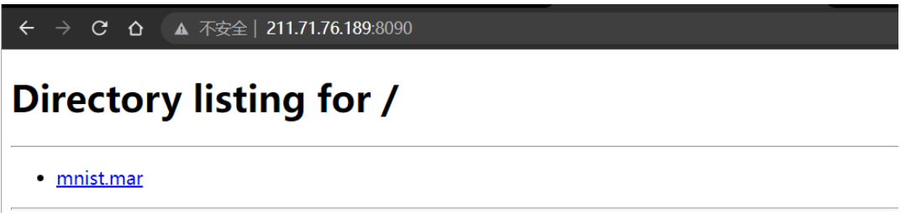
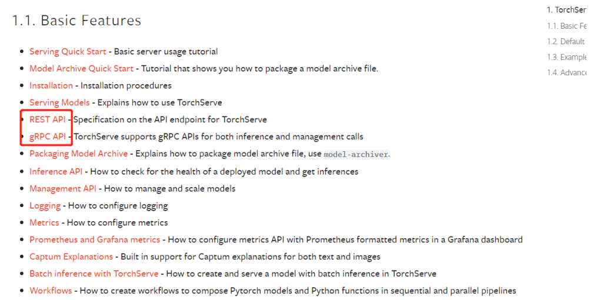

## 如何打包一个模型在torchserve上

### Dependency

1. 安装好torchserve环境

#### 一般方法（很久前测试，如果有bug自查解决）

   拉取image

```bash
docker pull pytorch/torchserve:0.5.2-cpu
```

   运行

```bash
docker run -d --rm -it -p 6080:8080 -p 6081:8081 -p 6082:8082 -p 7070:7070 -p 7071:7071 --volume /data/MengQingqiang/rpc/model_store:/tmp/models pytorch/torchserve:0.5.2-cpu torchserve --start --model-store /tmp/models/  --no-config-snapshots
```

   > /data/MengQingqiang/rpc/model_store 是指定宿主机模型存储位置
   >
   > 6080 推理http接口 6081 模型管理 http接口 
   >
   > 7070 推理grpc接口 7071模型管理 grpc接口 

#### 本人保存过的镜像

   注意： 如果你用48号服务器，本人保存了一个镜像 torchserer:v1.2.1 这个拼写错误忽略 或者重新commit一个正确的使用

   执行以下命令即可 

```
docker run  --rm -it -p 6080:8080 -p 6081:8081 -p 6082:8082 -p 7070:7070 -p 7071:7071 --volume /data/MengQingqiang/rpc/model_store:/tmp/models torchserer:v1.2.1 torchserve --start --model-store /tmp/models/ --models greedy_distance.mar --no-config-snapshots
```

   如果端口显示占用，查看容器是否运行，一般来说都在运行，因为揽件平台依赖这个服务

2. 需要安装torch-model-archiver

   ```
    pip install torch-model-archiver
   ```

   > 注意采用pip 或者conda的方式安装，避免采用yum apt-get等方式绑定到系统python而非conda虚拟环境python

   >  可以采用  which  torch-model-archiver 查看使用了哪个包管理下的软件，利用alias可以指定具体的

### Quick Start

1. 拉取serve源代码

```bash
git clone https://github.com/pytorch/serve.git
# 重命名为serve文件夹
mv serve-master serve
```

   > 我们可以看到这个文件夹中包含examples的文件夹，其中又分为图像分类、图像分割等，这个文件夹就是一个示例，包含了各种模型打包的示例

2. 打包代码

   我们打包示例程序，我们就举一个最基本的栗子，还记得mnist吗？

   examples/image_classiffer/mnist文件夹中包含了说明 readme文件

```bash
# 确保进入serve文件夹
cd serve
# 查看当前环境torch-model-archiver,确保采用的conda环境是安装torch-model-archiver正确的环境
wihch torch-model-archiver
# 打包
torch-model-archiver --model-name mnist --version 1.0 --model-file examples/image_classifier/mnist/mnist.py --handler  examples/image_classifier/mnist/mnist_handler.py
# 查看产物
ls -l | grep mnist.mar
```

3. 上传到serve服务器

   一共存在两种方式

   1. local file 把*.mar的文件复制到serve本地的模型文件夹（在启动torchserver时指定--model-store参数的文件夹）

      我们以211.71.76.189 gpu-48号服务器作为示例，该服务器上存在一个torchserve服务，且文件夹在/data/MengQingqiang/rpc/model_store/下，模型管理http端口是6081

```bash
cp mnist.mar /data/MengQingqiang/rpc/model_store/
```

​		这时候模型文件就存在本地，然后调用http接口让serve服务器运行这个模型

```bash
curl --location --request POST 'http://211.71.76.189:6081/models?url=mnist.mar'	
```

​		然后我们查看部署结果

```bash
curl --location --request GET 'http://211.71.76.189:6081/models/'
```

   2. 我们可以把当前的包含*.mar目录作为一个http服务器，让torchserve下载\*.mar文件后运行

      首先，我们新建一个目录来避免把整个serve源码作为服务器

```bash
mkdir -p model_store
mv mnist.mar model_store/
cd model_store
# 加 & 代表守护进程方式，退出当前会话后自动关闭，如果一直需要请使用screen，不推荐nohup
python -m http.server 8090 &
```

在浏览器打开当前服务器http://ip:8090 可以看到目录结构，以48号服务器做示例 http://211.71.76.189:8090/



最后，我们通过http接口进行模型上传到serve，同方法1中
    

```bash
curl --location --request POST 'http://211.71.76.189:6081/models?url=http://211.71.76.189:8090/mnist.mar'	
```

同样查看部署结果
    
```
curl --location --request GET 'http://211.71.76.189:6081/models/'
```

我们看到输出结果如下
    
```text
{
  "models": [
    {
      "modelName": "greedy_distance",
      "modelUrl": "greedy_distance.mar"
    },
    {
      "modelName": "greedy_time",
      "modelUrl": "greedy_time.mar"
    },
    {
      "modelName": "mnist",
      "modelUrl": "http://211.71.76.189:8090/mnist.mar"
    },
    {
      "modelName": "pointer_net",
      "modelUrl": "pointer_net.mar"
    }
  ]
}
```

其中mnist是网络位置，而不是本地位置

   4. 测试

      首先，模型初始化没有工作线程，我们调整mnist模型worker数量

```bash
curl --location --request PUT 'http://211.71.76.189:6081/models/mnist?min_worker=1&max_worker=2'
```

用这个命令才访问api接口，你会惊喜的发现 报错了，是的 官方提供的代码有bug

```
# 我们返回serve文件夹
cd serve 
# 
curl http://211.71.76.189:6080/explanations/mnist -T examples/image_classifier/mnist/test_data/0.png
```

没关系，我们至少完成了全生命周期的流程，这里的bug源自于官方的mnist的handler bug，在接下来的章节，我会介绍如何编写handler，如何查看bug发生在哪里，如何查看日志

### Serve my own model 

   ​	是的，如果你完成了上面的操作，你会发现torchsere没有人用的根本原因：资料很少且存在bug

   ​	下面我将为你介绍如何编写一个属于自己的代码

#### 为什么引入handler？

   ​	首先，我们要明白一个道理，我们的模型是无法直接适配到serve，这需要我们提供一个机制，如何去告诉serve我们的模型处理机制，这时候需要引入一个handler，说起来有点乱，我们画一个图来理解

  

   ​	这里仅仅是逻辑层面方便理解，handler文件torch官方提供了一些基础的handler，在文件夹 ts/torch_handler中

​      

**handler要求必须继承于base_handler.py**

   ​	base_handler中包含了以下方法

| 方法名      | 作用             | 备注                                                         |
| ----------- | ---------------- | ------------------------------------------------------------ |
| initialize  | 初始化方法       | 用于指定gpu，构造初始模型，加载模型权重，                    |
| preprocess  | 预处理方法       | 用于对于request加工预处理数据到模型指定格式                  |
| inference   | 推理方法（预测） | 用于调用initialize构造后的模型，进行预测                     |
| postprocess | 结果格式化方法   | 运行结束时的逻辑，把模型输出结果重新整理成想要的格式         |
| handle      | 推理过程         | 组织preprocess，inference，postprocess方法，每当serve遇到一次请求，只指定该方法 |

   我们查看handle方法源码就可以更好理解该过程

```python
   def handle(self, data, context):
          """Entry point for default handler. It takes the data from the input request and returns
              the predicted outcome for the input.
           Args:
               data (list): The input data that needs to be made a prediction request on.
               context (Context): It is a JSON Object containing information pertaining to
                                  the model artefacts parameters.
           Returns:
               list : Returns a list of dictionary with the predicted response.
           """
   
           # It can be used for pre or post processing if needed as additional request
           # information is available in context
           start_time = time.time()
   
           self.context = context
           metrics = self.context.metrics
   		# 首先进行预处理
           data_preprocess = self.preprocess(data)
   		# 判断时推断还是解释
           if not self._is_explain():
               # 推理
               output = self.inference(data_preprocess)
               # 后处理
               output = self.postprocess(output)
           else:
               output = self.explain_handle(data_preprocess, data)
   
           stop_time = time.time()
           metrics.add_time('HandlerTime', round(
               (stop_time - start_time) * 1000, 2), None, 'ms')
           # 返回结果
           return output
```

   画图描述handle方法内容


   

#### 动手写一个model 和 handler

我们从最简单的无参数模型开始写起

```python
import torch
import torch.nn as nn
import torch.nn.functional as F
import numpy as np


class GreedyTime(nn.Module):
    '''
        球面距离贪心策略，无参数
        输入: 期望到达时间,起点坐标
    '''

    def __init__(self):
        super(GreedyTime, self).__init__()

    def forward(self, x):
        (time_need, start) = x
        time_need = time_need.argsort()
        result = [start]
        for item in time_need:
            if item != start:
                result.append(item)
        return result
```

对应handler如下

```python
import json
from torchvision import transforms
from ts.torch_handler.image_classifier import ImageClassifier
from ts.torch_handler.base_handler import BaseHandler
import torch
import logging
import time
import numpy as np
from scipy.spatial.distance import pdist, squareform
logger = logging.getLogger(__name__)


class Greedy_Hander(BaseHandler):

    def handle(self, data, context):
        """Entry point for default handler. It takes the data from the input request and returns
           the predicted outcome for the input.
        Args:
            data (list): The input data that needs to be made a prediction request on.
            context (Context): It is a JSON Object containing information pertaining to
                               the model artefacts parameters.
        Returns:
            list : Returns a list of dictionary with the predicted response.
        """

        # It can be used for pre or post processing if needed as additional request
        # information is available in context
        start_time = time.time()

        self.context = context
        metrics = self.context.metrics

        data_preprocess = self.preprocess(data)

        if not self._is_explain():
            output = self.inference(data_preprocess)
            output = self.postprocess(output)
        else:
            output = self.explain_handle(data_preprocess, data)

        stop_time = time.time()
        metrics.add_time('HandlerTime', round(
            (stop_time - start_time) * 1000, 2), None, 'ms')
        return output

    def inference(self, data, *args, **kwargs):
        """
        The Inference Function is used to make a prediction call on the given input request.
        The user needs to override the inference function to customize it.
        Args:
            data (Torch Tensor): A Torch Tensor is passed to make the Inference Request.
            The shape should match the model input shape.
        Returns:
            Torch Tensor : The Predicted Torch Tensor is returned in this function.
        """
        logger.info('Inference come')
        results = self.model(data, *args, **kwargs)
        return results

    def postprocess(self, data):
        """
        The post process function makes use of the output from the inference and converts into a
        Torchserve supported response output.
        Args:
            data (Torch Tensor): The torch tensor received from the prediction output of the model.
        Returns:
            List: The post process function returns a list of the predicted output.
        """
        # logger.info("spring Data output:", data.toString())
        # print("[MQQ ]", data)
        data = torch.tensor(data).tolist()
        return [data]

    def preprocess(self, data):
        """
        Preprocess function to convert the request input to a tensor(Torchserve supported format).
        The user needs to override to customize the pre-processing
        Args :
            data (list): List of the data from the request input.
            [{'body': [[1, 2, 3], [1, 2, 3]]}]
            the input of your data is this format
        Returns:
            tensor: Returns the tensor data of the input
        """
        # not support batch to deal
        '''
            {
    "feature": [
        [
            463.1333333333333,
            120.180503,
            30.323697,
            5,
            2.019472122917776,
            118,
            196.86666666666667,
            44.950000000000045
        ],
        [
            463.1333333333333,
            120.180503,
            30.323697,
            5,
            2.019472122917776,
            118,
            196.86666666666667,
            44.950000000000045
        ]
    ],
    "start": 1}
        '''
        logger.info("[hander] greedy_time raw data: %s" % str(data))
        body = data[0].get('body')
        logger.info("[hander] greedy_time body type: %s" % str(type(body)))
        if type(body) == bytearray:
            # to deal with grpc interface
            body = bytes(body)
            body = json.loads(body)
            logger.info("[handler] from grpc")
        else:
            logger.info("[handler] from http api")
        logger.info("[handler] greedy_time body :%s " %str(body))
        logger.info("[handler] greedy_time body after type: %s" % str(type(body)))
        # logger.info("[handler] greedy_distance input:", data)
        feature = body.get('feature')
        start = body.get('start')
        # logger.info("[handler] greedy_distance input:", data)
        # 转换feature为 ndarray
        feature = np.array(feature)
        # select for the distance of feature
        # logger.info("[hander] greedy_distance feature shape :", feature.shape)
        logger.info("[hander] greedy_time feature: %s", str(feature))
        feature = feature[:, 0]
        logger.info("[hander] greedy_time feature after: %s", str(feature))
        # logger.info("[hander] greedy_distance feature:", feature)
        model_input = (feature, start)
        logger.info("process ok")
        return model_input


```

handler中在preprocess中，我们首先约定了输入格式为以下的json串，然后在预处理按照该格式解析

```
  {
    "feature": [
        [
            463.1333333333333,
            120.180503,
            30.323697,
            5,
            2.019472122917776,
            118,
            196.86666666666667,
            44.950000000000045
        ],
        [
            463.1333333333333,
            120.180503,
            30.323697,
            5,
            2.019472122917776,
            118,
            196.86666666666667,
            44.950000000000045
        ]
    ],
    "start": 1
}
```

把这两个文件放在example下，类似于quick start 运行打包命令

```bash
torch-model-archiver --model-name greedy_time  --model-file ../serve/examples/image_classifier/greedy_time/greedy_time.py --handler ../serve/examples/image_classifier/greedy_time/greedy_time_handler.py  --runtime python3 --version 1.0
```

按照quick start方式上传到serve 调用接口

```bash
curl --location --request POST 'http://211.71.76.189:6080/predictions/greedy_time/1.0' \
--header 'Content-Type: application/json' \
--data-raw '{
    "feature": [
        [
            463.1333333333333,
            120.180503,
            30.323697,
            5,
            2.019472122917776,
            118,
            196.86666666666667,
            44.950000000000045
        ],
        [
            463.1333333333333,
            120.180503,
            30.323697,
            5,
            2.019472122917776,
            118,
            196.86666666666667,
            44.950000000000045
        ]
    ],
    "start": 1
}'
```

得到结果

```
[
  1,
  0
]
```

### tips

1. 模型文件 model.py仅仅只能包含一个类，

2. 如果我的模型包括model_layers.py model.py 并且model.py是多个类如何解决？

   可以定义一个新文件model_submit.py中 把最终的模型类再封装一层，在打包时指定参数extra-files

   ```bash
   torch-model-archiver --model-name pointer_net  --model-file ../serve/examples/image_classifier/pointer_net/pointer_net.py \
       --handler ../serve/examples/image_classifier/pointer_net/pointer_net_handler.py  \
       --extra-files  ../serve/examples/image_classifier/pointer_net/pointer_net_layers.py  \
       --runtime python3 --version shanghai
   ```

   同理，如果模型包括其他配置文件 比如 json yml 等也可以通过extra-files打入mar包

   extra-files 的作用是让该文件一起打包进mar，模型可以访问

3. 如何查看日志 debug

   以docker方式启动的serve 可以采用 docker logs <container id> -f 查看日志

4. 如果我需要更多的python包怎么办

   进入容器安装

5. 为什么我访问接口400 500

   命令存在错误 或者指定的内容非法，查看日志中原因

6. 为什么我远程加载模型失败，显示本地已经存在一个包

   如果本地存在x.mar则远程无法加载新的同名mar包，原因：serve会下载mar包到本地目录，然后运行，再卸载该模型后会删除本地mar包，因此如果下载显示本地已经存在，则不会继续后续操作

7. 接口一定用命令行访问吗？

   不一定，因为是http接口，所以任何通过http的方式都可以访问，比如postman、程序代码 都可以

8. 官方文档在哪里？

   https://pytorch.org/serve/index.html

9. 如何查看接口？

   

10. 如何通过grpc访问？

    查看postrpc项目示例