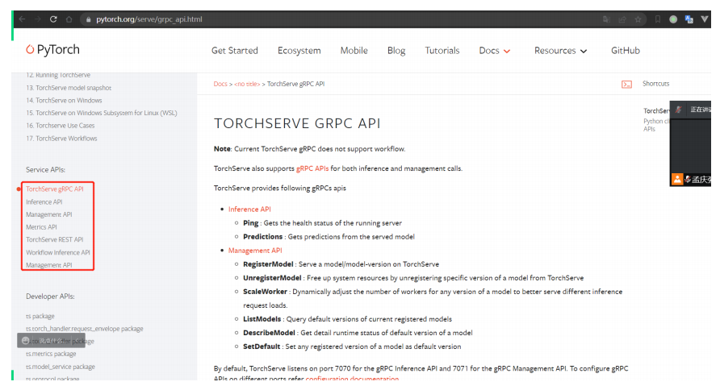
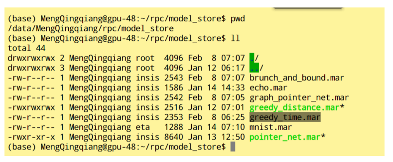
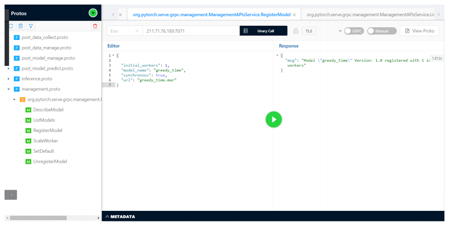
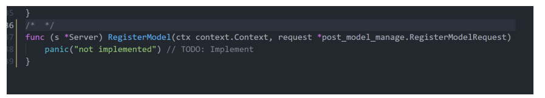
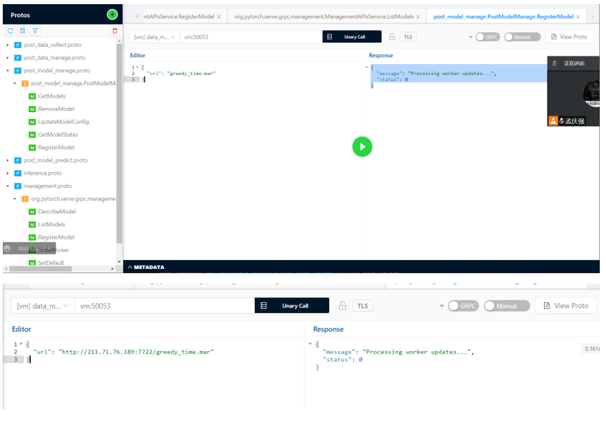
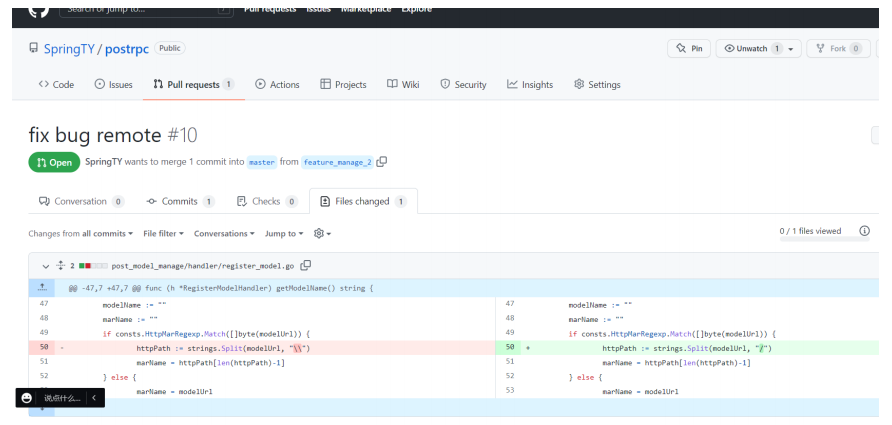

post服务添加接口

我们以添加一个注册模型的接口进行演示

采用

torchserve -> post_model_manage(rpc) -> postapi(http) -> postweb(web)的顺序

### 1. 测试torchserve grpc接口

用bloomRPC进行加载torchserve的proto文件,尝试注册模型

可以通过我们启动docker的命令查看到torchserve的运行端口，命令如下

```bash
sudo docker run -d --rm -it -p 6080:8080 -p 6081:8081 -p 6082:8082 -p 7070:7070 -p 7071:7071 --volume /data/MengQingqiang/rpc/model_store:/tmp/models pytorch/torchserve:0.5.0-cpu torchserve --start --model-store /tmp/models/ --no-config-snapshots
```

结合torchserve的官方文档https://pytorch.org/serve/grpc_api.html，torchserve中7071是模型管理的grpc接口 



​     因此我们找到Register模型的方法，尝试注册一个模型, 选择本地，通过启动命令我们知道,模型目录是在/data/MengQingqiang/rpc/model_store，因此我们把一个模型放到这个目录下尝试通过grpc方式注册。

最方便的方式是我们卸载一个本地加载的模型，启动前端进行卸载(为了方便操作)，



可以看到本地目录存在这个mar包，现在我们进行注册




ok,现在已经成功说明接口不存在问题，现在我们需要开发来实现这个部分。

### 2. 在postrpc中的post_model_manage添加一个注册模型的rpc接口

#### 2.1 首先clone下postrpc服务

> git clone https://github.com/SpringTY/postrpc.git
>
> 我本地之前有这个model,所以不需要这个步骤

#### 2.2 更改idl文件

首先，我们打开postrpc文件夹，发现其中存在idl/post_model_manage.proto文件，在其中新加一个接口RegisterModel

```protobuf
// add Request Struct
message RegisterModelRequest{
  string url = 1;
}
// add Response Struct
message RegisterModelResponse{
  string message = 1;
  int32 status = 2;
}

service PostModelManage{
    rpc GetModels (GetModelsRequest) returns (GetModelsResponse) {}
    rpc RemoveModel (RemoveModelRequest) returns (RemoveModelResponse) {}
    rpc UpdateModelConfig (UpdateModelConfigRequest) returns (UpdateModelConfigResponse) {}
    rpc GetModelStates(GetModelStatesRequest) returns (GetModelStatesResponse) {}
    rpc RegisterModel(RegisterModelRequest) returns (RegisterModelResponse){} // 这里是新加的
}
```

#### 2.3 重新生成客户端和服务端代码

我们采用sh/post_data_manage.sh的脚本生成代码,这个脚本是我自己写的，因此如果新建rpc服务可以仿照这个脚本写生成代码逻辑

```bash
sh/post_data_manage.sh
```

运行命令后，使用git status发现存在两部分的代码发生改变 一部分为rpc_sdk(客户端)另一部分为当前目录下的post_model_manage(服务端)

```text
(base) pi@ubuntu:/mnt/hgfs/share_vm/postrpc$ sh/post_model_manage.sh 
IDL:sh/../idl/post_model_manage.proto
(base) pi@ubuntu:/mnt/hgfs/share_vm/postrpc$ git status
位于分支 feature_manage_2
尚未暂存以备提交的变更：
  （使用 "git add <文件>..." 更新要提交的内容）
  （使用 "git restore <文件>..." 丢弃工作区的改动）
        修改：     post_model_manage/idl/post_model_manage/post_model_manage.pb.go
        修改：     post_model_manage/idl/post_model_manage/post_model_manage_grpc.pb.go
        修改：     rpc_sdk/post_model_manage/post_model_manage.pb.go
        修改：     rpc_sdk/post_model_manage/post_model_manage_grpc.pb.go

修改尚未加入提交（使用 "git add" 和/或 "git commit -a"）
```

每次我们新添加rpc的接口的时候需要重新执行这个脚本，建议确认工作区无变动时执行

#### 2.4 实现服务中的接口

#### 接口实现

打开postrpc目录下的post_model_manage文件夹，在hander.go中，我们让Server结构体实现idl/post_data_manage包下的PostModelManageServer接口 这里有点不太确定 PostModelManageServer 和UnsafePostModelManageServer的区别，可以去看代码或者研究grpc加载服务的逻辑，ok, 现在确定乐是需要实现post_model_manage/idl/post_model_manage.PostModelManageServer接口

可以看到IDE选择实现接口时生成了一个方法，对应我们刚才在IDL中声明的接口



现在我们要实现这个方法，因为默认时抛一个异常

在handler包下新建一个文件叫做register_model.go

```go
package handler

import (
	"context"
	"post_model_manage/idl/post_model_manage"
)

type RegisterModelHandler struct {
	Request  *post_model_manage.RegisterModelRequest
	Response *post_model_manage.RegisterModelResponse
	Ctx      context.Context
}

func NewRegisterModelHandler(Ctx context.Context, Request *post_model_manage.RegisterModelRequest) *RegisterModelHandler {
	return &RegisterModelHandler{
		Request: Request,
		Ctx:     Ctx,
		Response: &post_model_manage.RegisterModelResponse{
			Message: "success",
			Status:  0,
		},
	}
}
func (h *RegisterModelHandler) Run() {
}

func (h *RegisterModelHandler) CheckParam() error {

	return nil
}
```

可以看到，我们代码包含一个RegisterModelHandler，与同包下其他文件类似，这类似于一个http服务的一个Controller，RegisterModelHandler其中存在两个方法，一个是Run另一个是CheckParam

##### Run方法

具体的业务逻辑实现代码

##### CheckParm

输入参数检查代码

#### Register Model Handler的业务逻辑

我们的业务逻辑也很简单，就是1.读取输入的url 2.调用torchserve的grpc接口进行注册模型 3. 返回响应

##### 调用torchserve grpc部分

因为模型管理模块已经写过torchserve grpc逻辑，我们打开post_model_manage/rpc文件夹下的management.go进行添加注册模型逻辑

```go
func RegisterModel(ctx context.Context, url, modelName string) (string, error) {
	req := &pb.RegisterModelRequest{
		InitialWorkers: 1,
		ModelName:      modelName,
		Synchronous:    false, //是否是同步加载,我们选择异步加载
		Url:            url,
	}
	resp, err := management_client.RegisterModel(ctx, req)
	if err != nil {
		log.Printf("[Error] Error call rpc RegisterModel, err: %v", err)
		return err.Error(), err
	}
	return resp.Msg, nil
}
```

##### RegisterModelHandler CheckParam逻辑

这里做参数校验, 可以允许两种类型参数http://xxx/xxx/xxx.mar 网络位置 和xxx.mar 本地位置

可以用正则表达式来做, 选择用正则

```go
const httpMarReg = "(https?|ftp|file)://[-A-Za-z0-9+&@#/%?=~_|!:,.;]+[-A-Za-z0-9+&@#/%=~_|].mar"
const localMarReg = ".*.mar"

var HttpMarRegexp *regexp.Regexp
var LocalMarRegexp *regexp.Regexp

func Init() {
	HttpMarRegexp = regexp.MustCompile(httpMarReg)
	LocalMarRegexp = regexp.MustCompile(localMarReg)
}

```

##### RegisterModelHandler  Run 逻辑

有两种方式获取modelName 一种grpc的请求传参，另一种约定以mar包的包名，我们现在做以包名的方式命名模型名

```go
package handler

import (
	"context"
	"fmt"
	"log"
	"post_model_manage/consts"
	"post_model_manage/idl/post_model_manage"
	"post_model_manage/rpc"
	"strings"
)

type RegisterModelHandler struct {
	Request  *post_model_manage.RegisterModelRequest
	Response *post_model_manage.RegisterModelResponse
	Ctx      context.Context
}

func NewRegisterModelHandler(Ctx context.Context, Request *post_model_manage.RegisterModelRequest) *RegisterModelHandler {
	return &RegisterModelHandler{
		Request: Request,
		Ctx:     Ctx,
		Response: &post_model_manage.RegisterModelResponse{
			Message: "success",
			Status:  0,
		},
	}
}
func (h *RegisterModelHandler) Run() {
	err := h.CheckParam()
	if err != nil {
		h.Response.Status = 1
		h.Response.Message = err.Error()
		return
	}
	modelUrl := h.Request.Url
	modelName := h.getModelName()
	toast, err := rpc.RegisterModel(h.Ctx, modelUrl, modelName)
	if err != nil {
		h.Response.Status = 1
		h.Response.Message = err.Error()
		return
	}
	h.Response.Message = toast
}
func (h *RegisterModelHandler) getModelName() string {
	modelUrl := h.Request.Url
	modelName := ""
	marName := ""
	if consts.HttpMarRegexp.Match([]byte(modelUrl)) {
		httpPath := strings.Split(modelUrl, "\\")
		marName = httpPath[len(httpPath)-1]
	} else {
		marName = modelUrl
	}
	// ".mar"
	modelName = marName[:len(marName)-4]
	return modelName
}
func (h *RegisterModelHandler) CheckParam() error {
	modelUrl := h.Request.Url
	if consts.HttpMarRegexp.Match([]byte(modelUrl)) {
		return nil
	}
	if consts.LocalMarRegexp.Match([]byte(modelUrl)) {
		return nil
	}
	return fmt.Errorf("modelUrl is valid:%s", modelUrl)
}

```

##### 在handler.go中实现逻辑

```go
func (s *Server) RegisterModel(ctx context.Context, request *post_model_manage.RegisterModelRequest) (*post_model_manage.RegisterModelResponse, error) {
	Handler := handler.NewRegisterModelHandler(ctx, request)
	Handler.Run()
	return Handler.Response, nil
}
```

##### 测试

> sh build.sh
>
> out/post_model_manage

分别测试本地和网络位置




由此grpc的部分已经做好

### API部分

首先我们git clone下api代码

#### 定义接口

我们定义注册模型请求为post请求且 path如下

> /model/register
>
> model_url是body的一个属性

在main.go中添加一个

```go
r.POST("/model/register", handler.RegisterModelHandler)
```

然后在handler里面添加一个文件register_model_handler.go 在该文件中添加方法RegisterModelHandler，

>  事实上你可以定义一个接口体RegisterModelHandler，并替换main.go中的函数为handler wrapperRegisterModel,
>
> 在wrapperRegisterModelHandler 进行参数验证，并且生成一个RegisterModelHandler执行RegisterModelHandler.RUN 这更加规范，但是我懒得这个搞了

```go
package handler

import (
	"net/http"
	view_model "postapi/model/view"

	"github.com/gin-gonic/gin"
)

type RegisterModelBody struct {
	ModelUrl string `json:"model_url"`
}

func RegisterModelHandler(c *gin.Context) {
	body := RegisterModelBody{}
	err := c.BindJSON(&body)
	if err != nil {
		c.JSON(http.StatusBadRequest, nil)
		return
	}
	toast, err := RegisterModel(c, &body)
	if err != nil {
		c.JSON(http.StatusInternalServerError, nil)
		return
	}
	resp := &view_model.CommonResult{
		Message: toast,
		Status:  0,
	}
	c.JSON(http.StatusOK, resp)
}
func RegisterModel(ctx *gin.Context, body *RegisterModelBody) (string, error) {
	//调用post_model_manage 逻辑
}

```

#### 调用post_model_manage 

首先，我们更新rpc依赖

```bash
go get github.com/SpringTY/postrpc
```

然后在rpc/model_manage.go中添加RegisterModel方法

```go
func RegisterModel(ctx context.Context, modelUrl string) (string, error) {
	req := &post_model_manage.RegisterModelRequest{
		Url: modelUrl,
	}
	resp, err := model_manage_client.RegisterModel(ctx, req)
	if err != nil {
		return "", err
	} else if resp.Status != 0 {
		return "", errors.New(resp.Message)
	}
	return resp.Message, nil
}
```

register_model.go中逻辑

```
func RegisterModel(ctx *gin.Context, body *RegisterModelBody) (string, error) {
	//调用post_model_manage 逻辑
	toast, err := rpc.RegisterModel(ctx, body.ModelUrl)
	if err != nil {
		return "", err
	}
	return toast, nil
}
```


我稍稍改动了一些register_model.go的RegisterModelHandler逻辑 见代码


#### 测试

首先启动rpc服务 更改我们调用rpc服务的地址为本地进行测试

地址为rpc/model_manage.go 的model_manage_address变量

> go run main,go

```bash
import http.client
import json

conn = http.client.HTTPSConnection("vm", 7675)
payload = json.dumps({
  "model_url": "greedy_time.mar"
})
headers = {
  'Content-Type': 'application/json'
}
conn.request("POST", "/model/register", payload, headers)
res = conn.getresponse()
data = res.read()
print(data.decode("utf-8"))
```

测试接口


## bugs

刚才发现如果加载网络位置模型会导致无法打开列表，并且模型的url不正确，现在fix一下

