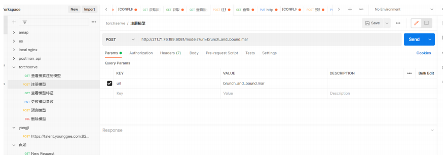
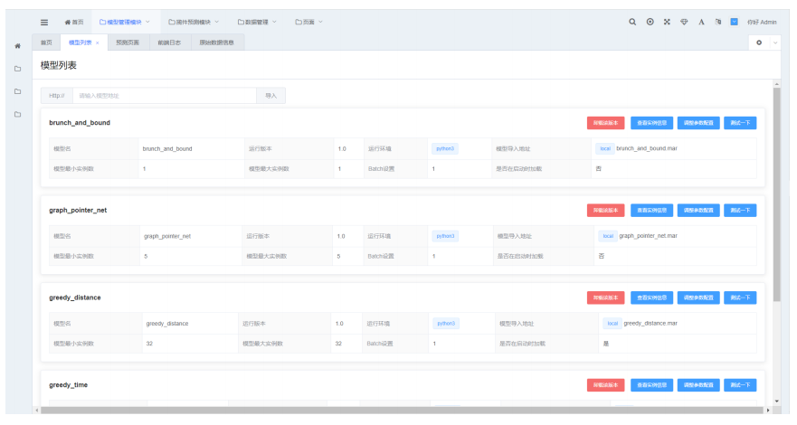
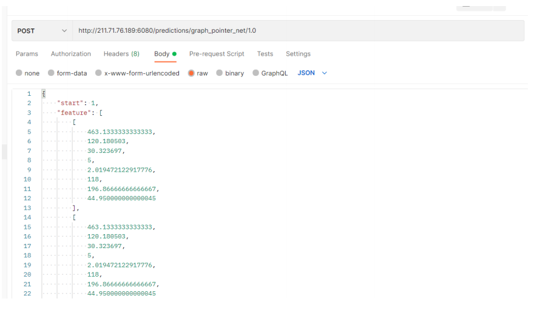

首先揽件平台前端部署在211.71.76.189服务器上

#### 算法接入

如果需要接入模型到该平台(可以是任何torch算法)

首先需要打包成为mar包，打包部分有一个文档介绍

默认使用者得到了mar包程序，把mar包放在任意网络位置http服务或者在189 服务器/data/MengQingqiang/rpc/model_store路径下

导入到系统：如果采用http服务 就是全路径  如果采用放在服务器本地 就是文件名

方式1. 采用torchserve api :

方式2. 前端(尚未支持)

.png)

方式3.postapi(等待前端部署)

.png)

####   算法管理

该界面包含模型模型的卸载、实例调整等功能

#### 算法调用

调用原生torchserve http api

参考文档 https://pytorch.org/serve/inference_api.html#predictions-api

