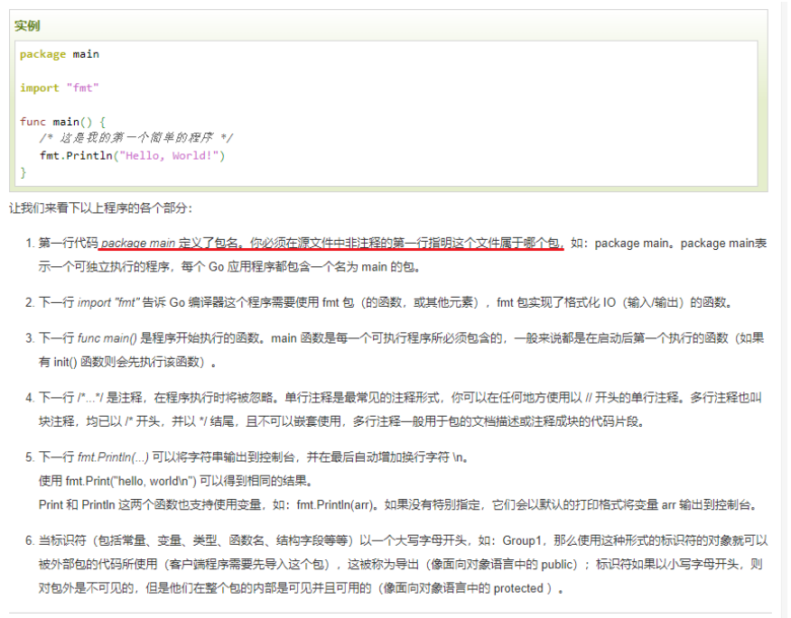
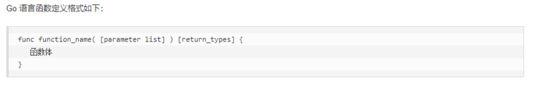
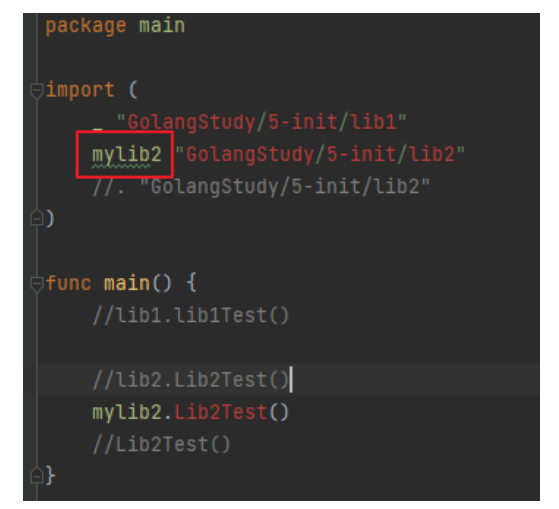
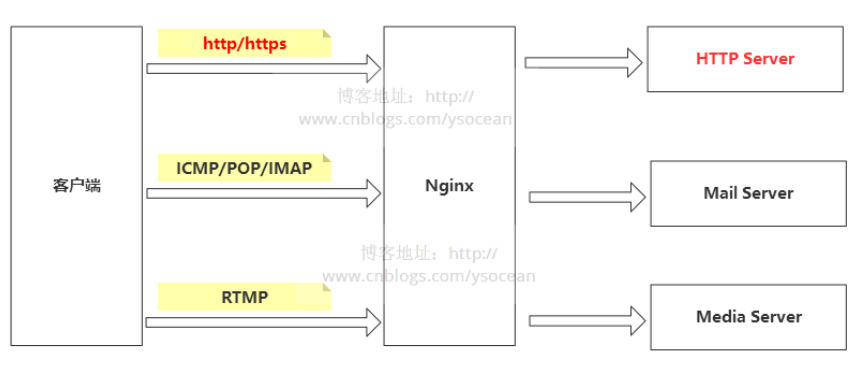
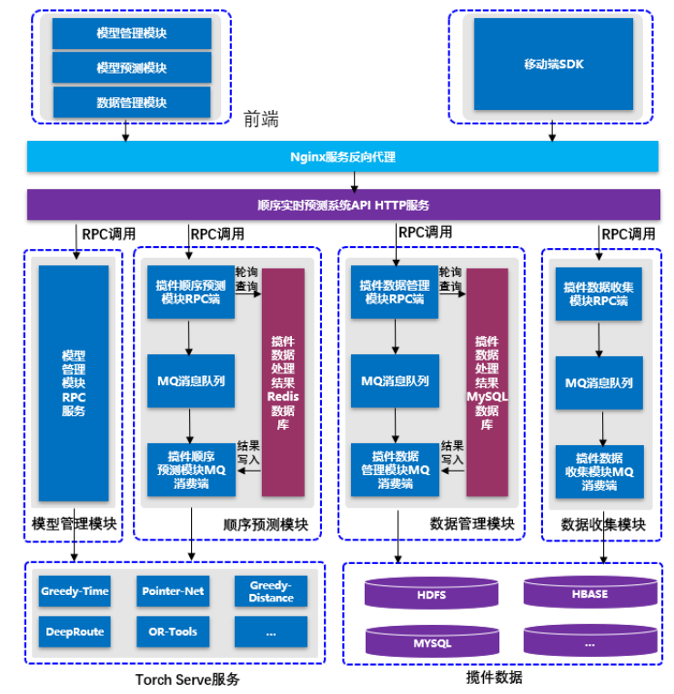
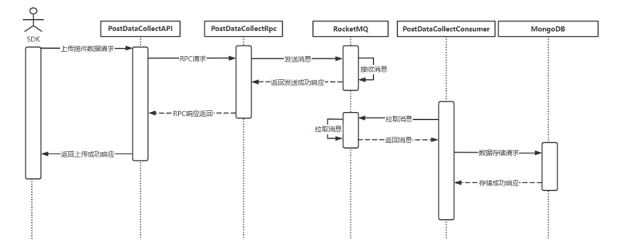
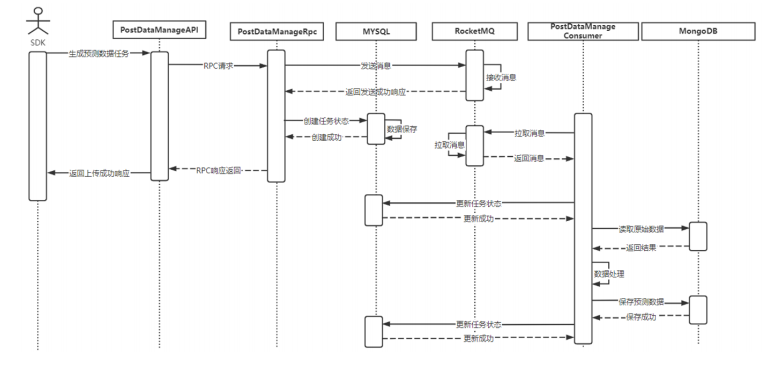
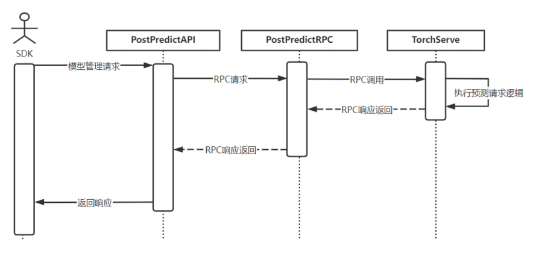
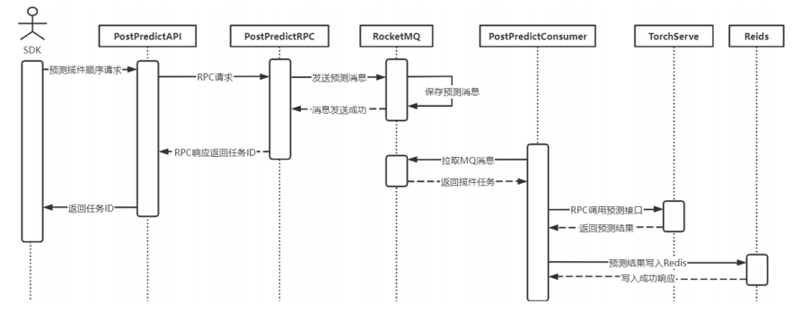

## 1 go语言

###  1.1 go语言用途

Go 语言被设计成一门应用于**搭载 Web 服务器**，存储集群或类似用途的巨型中央服务器的系统编程语言。对于高性能分布式系统领域而言，Go 语言无疑比大多数其它语言有着更高的开发效率。

*windows go环境开发配置*

[安装go和goLand](https://www.jb51.net/article/197314.htm)

其中GoLand是Go语言的IDE，类似Pycharm；

### 1.2 go语言相关语法

[学习链接](https://www.runoob.com/go/go-tutorial.html)




函数定义：



给引入的包一个别名



指针：（go语言中的指针和C中的语法和用法差不多）

```go
func swap(pa *int, pb *int) {
	var temp int
	temp = *pa //temp = main::a
	*pa = *pb  // main::a = main::b
	*pb = temp // main::b = temp
}

func main() {
	var a int = 10
	var b int = 20
	swap(&a, &b)
	fmt.Println("a = ", a, " b = ", b)
}
```


[defer关键字](http://c.biancheng.net/view/61.html):延迟调用，将后面的内容放入调用栈，最先放入的最后被调用。

```go
package main

import "fmt"

func main() {
	//写入defer关键字
	defer fmt.Println("main end1")#最后执行
	defer fmt.Println("main end2")


	fmt.Println("main::hello go 1")
	fmt.Println("main::hello go 2")
}
```

数组：数组的操作也和C很像

```go
func main() {
	//固定长度的数组
	var myArray1 [10]int

	myArray2 := [10]int{1,2,3,4}
	myArray3 := [4]int{11,22,33,44}

	//for i := 0; i < 10; i++ {
	for i := 0; i < len(myArray1); i++ {
		fmt.Println(myArray1[i])	
	}

	for index, value := range myArray2 {
		fmt.Println("index = ", index, ", value = ", value)
	}

	//查看数组的数据类型
	fmt.Printf("myArray1 types = %T\n", myArray1)
	fmt.Printf("myArray2 types = %T\n", myArray2)
	fmt.Printf("myArray3 types = %T\n", myArray3)

	printArray(myArray3)
	fmt.Println(" ------ ")
	for index, value := range myArray3 {
		fmt.Println("index = ", index, ", value = ", value)
	}
}
```

map字典声明：

```go
package main
import "fmt"
func main() {
	//===> 第一种声明方式

	//声明myMap1是一种map类型 key是string， value是string
	var myMap1 map[string]string
	if myMap1 == nil {
		fmt.Println("myMap1 是一个空map")
	}

	//在使用map前， 需要先用make给map分配数据空间
	myMap1 = make(map[string]string, 10)

	myMap1["one"] = "java"
	myMap1["two"] = "c++"
	myMap1["three"] = "python"
	fmt.Println(myMap1)

	//===> 第二种声明方式
	myMap2 := make(map[int]string)
	myMap2[1] = "java"
	myMap2[2] = "c++"
	myMap2[3] = "python"
	fmt.Println(myMap2)

	//===> 第三种声明方式
	myMap3 := map[string]string{
		"one":   "php",
		"two":   "c++",
		"three": "python",
	}
	fmt.Println(myMap3)
}

```

map字典操作：

```go
func main() {
	cityMap := make(map[string]string)

	//添加
	cityMap["China"] = "Beijing"
	cityMap["Japan"] = "Tokyo"
	cityMap["USA"] = "NewYork"

	//遍历
	printMap(cityMap)

	//删除
	delete(cityMap, "China")

	//修改
	cityMap["USA"] = "DC"
	ChangeValue(cityMap)

	fmt.Println("-------")

	//遍历
	printMap(cityMap)
}
```


结构体：

```go
//如果类名首字母大写，表示其他包也能够访问
type Hero struct {
	//如果说类的属性首字母大写, 表示该属性是对外能够访问的，否则的话只能够类的内部访问
	Name  string
	Ad    int
	level int
}
func (this *Hero) Show() {
	fmt.Println("Name = ", this.Name)
	fmt.Println("Ad = ", this.Ad)
	fmt.Println("Level = ", this.level)
}

func (this *Hero) GetName() string {
	return this.Name
}

func (this *Hero) SetName(newName string) {
	//this 是调用该方法的对象的一个副本（拷贝）
	this.Name = newName
}
func main() {
	//创建一个对象
	hero := Hero{Name: "zhang3", Ad: 100,level :1}
	hero.Show()
	hero.SetName("li4")
	hero.Show()
}
```

类的继承：

```go
type Human struct {
	name string
	sex  string
}
type SuperMan struct {
	Human //SuperMan类继承了Human类的方法

	level int
}
```


接口

```go
//interface 本质是一个指针
type AnimalIF interface {
	Sleep()
	GetColor() string //获取动物的颜色
	GetType() string  //获取动物的种类
}
//具体的类
type Cat struct {
	color string //猫的颜色
}

func (this *Cat) Sleep() {
	fmt.Println("Cat is Sleep")
}

func (this *Cat) GetColor() string {
	return this.color
}

func (this *Cat) GetType() string {
	return "Cat"
}
func main() {

	cat := Cat{"Green"}

	showAnimal(&cat)
	showAnimal(&dog)
}
```


### 1.2 Go 设置Proxy

可以通过配置Goproxy避免模块拉取缓慢或者失败，加速构建；

## 2 消息队列

用于在不同服务之间传递信息；最大的特点是异步、削峰。

MQ（Message Queue）消息队列，MQ就是消息队列的简称。

## 3 [Nginx 反向代理](https://www.cnblogs.com/ysocean/p/9392908.html)


Nginx 服务器的反向代理服务是其最常用的重要功能，要了解nginx反向代理，需要了解Nginx、代理、正向和反向几个概念

### 3.1 代理&Nginx

代理可以理解为服务的中间件。可以用房屋中介类比代理。




### 3.2 正向/反向代理

正向代理：这里我再举一个例子：大家都知道，现在国内是访问不了 Google的，那么怎么才能访问 Google呢？我们又想，美国人不是能访问 Google吗（这不废话，Google就是美国的），如果我们电脑的对外公网 IP 地址能变成美国的 IP 地址，那不就可以访问 Google了。你很聪明，VPN 就是这样产生的。我们在访问 Google 时，先连上 VPN 服务器将我们的 IP 地址变成美国的 IP 地址，然后就可以顺利的访问了。这里的 VPN 就是做正向代理的。**正向代理服务器位于客户端和服务器之间，为了向服务器获取数据，客户端要向代理服务器发送一个请求，并指定目标服务器，代理服务器将目标服务器返回的数据转交给客户端。**这里客户端是要进行一些正向代理的设置的。

反向代理：反向代理，其实客户端对代理是无感知的，因为客户端不需要任何配置就可以访问，我们只需要将请求发送到反向代理服务器，由反向代理服务器去选择目标服务器获取数据后，在返回给客户端，此时**反向代理服务器和目标服务器对外就是一个服务器，暴露的是代理服务器地址，隐藏了真实服务器IP地址。**

总结：正向代理代理的是客户端，反向代理代理的是服务器。

## 4 前端

前端基于[D2admin](https://d2.pub/zh/doc/d2-admin/#%E5%8A%9F%E8%83%BD)开发；D2Admin (opens new window)是一个完全 开源免费 的企业中后台产品前端集成方案，使用最新的前端技术栈。

使用D2admin需要有以下前置知识：

- 首先需要熟悉 web 开发基础三样： [HTML CSS JavaScript(opens new window)](http://www.w3school.com.cn/)
- 会使用 [vue.js](https://cn.vuejs.org/)

## 5 平台相关

### 5.1 系统总体设计



对于快递揽件顺序预测系统，应具有拓展性、易用性和可维护性。平台应采用**微服务**设计，前端通过**http服务访问系统接口api，http服务采用远程过程调用各个模块服务。**

前端服务分为揽件数据管理模块、揽件顺序预测模块和模型管理模块，SDK中包含揽件数据上传功能和揽件顺序预测功能。前端和SDK通过http协议与揽件顺序预测平台服务端进行交互，首先请求会转发到nginx服务器进行请求转发，根据服务器负载情况转发到不同的揽件顺序预测系统http服务（API）上，http服务通过远程过程调用（RPC）进行与各个微服务模块进行交互，微服务模块接受到API的RPC请求后，会执行具体业务逻辑，返回结果给API，数据最终被返回到前端或SDK进行展示、渲染。

揽件数据采集功能由揽件数据采集模块进行，首先SDK的带有快递员揽件数据的请求经过数据流，到达揽件数据采集模块RPC服务后，该RPC服务会把数据信息发送到MQ消息队列中，然后返回RPC成功响应，通过一系列数据流返回给SDK成功响应，MQ消息队列中的带有揽件数据的消息会被揽件数据MQ消费端处理消费，经过处理的数据会持久化到mongodb中，该过程是异步的，目的是减少采集功能的响应时间，异步多实例消费处理数据提高系统处理数据效率。

揽件数据管理模块提供揽件数据处理功能和揽件数据展示功能。揽件数据展示功能是前端对应模块通过http请求拉取处理后的揽件预测数据信息，揽件数据管理模块RPC服务端收到请求后会访问mongodb返回数据，前端模块收到数据信息后通过**leaflet（一种GIS框架）展示揽件轨迹信息**。揽件数据管理模块对于快递员上传的原始揽件数据处理也是异步的，调用RPC揽件数据处理方法会产生数据处理任务，任务信息存入MYSQL数据库，返回任务ID，前端可以通过查询任务接口携带ID查看任务处理进度。

模型管理模块在前端提供UI界面进行平台模型管理，包括模型加载、模型卸载、模型调整运行时参数、模型状态查询操作，前端请求通过API调用到模型管理模块RPC模块以同步的方式调用下游服务返回结果。

揽件预测模块能够提供同步、异步的揽件顺序预测功能，前端或SDK发出的揽件顺序预测请求经过数据流到达预测RPC模块后，同步预测会直接返回预测结果，异步预测会返回预测任务ID，方便后续查看任务状态。同时，对应预测模块前端页面会通过Leaflet展示出预测揽件轨迹。

快递员揽件顺序预测系统中存在多种数据，根据其形式类别可以分为**数据库数据、消息队列消息和模型包。**
		快递员揽件顺序预测系统使用了三种数据库，根据数据种类不同选择不同的数据库作为存储，分别为**关系型数据库MYSQL、键值对数据库Redis和文档型数据库Mongodb**。

### 5.2 系统存储设计

- 揽件数据：1）原始揽件数据：文档数据库MongoDB		2）经过处理可输入模型预测的数据：文档数据库MongoDB
- 任务数据：
  - 1）异步预测任务数据 ：异步预测任务数据仅需要**短时间有效性记录，因此采用Redis这类缓存数据库进行存储**
  - 2）揽件数据处理任务数据：揽件数据处理任务**数据比较少且需要持久化保存处理记录，因此采用MYSQL数据库存储**
- 消息数据：
  - 揽件数据收集消息
  - 揽件顺序异步预测消息
  - 揽件数据处理消息
- 模型数据：模型是**mar**包格式，使用**torchserve**进行管理

### 5.3 系统技术选型

系统采用微服务思想，并且前后端分离设计，总体分为服务端、前端。
服务端包括数据层、RPC层和API层；

- API层：外部请求的接入层，a）采用基于go语言的高性能http服务器框架gin b）采用nginx进行请求转发，实现负载均衡。
- RPC层：
  - 采用go语言框架grpc开发，基于**接口定义语言（Interface Definition Language， IDL）**生成不同语言的客户端代码，从而实现跨语言调用；
  - RPC多实例采用consul进行服务发现、envoy实现动态代理，保证RPC服务的负载均衡
- 消息队列：采用**RocketMQ框架**，其具有高性能、监控全的特点。
- 数据库：根据数据特性和访问方式采用：Redis、MYSQL、Mongodb
- 深度学习生产环境平台：**torchserve**，该框架是由pytorch团队提供的深度学习生产环境框架，能够动态加载符合规范的模型。
- 前端：
  - 采用**Vue.js**响应式框架，
  - GIS框架采用**Leaflet-Vue**进行图形展示，GIS图层采用高德地图图层。
  - SDK采用Java开发包进行开发，能够被基于Java开发的程序接入，如安卓程序等。

### 5.4 系统实现细节

**5.4.1 揽件数据采集模块时序图**



揽件数据采集模块包含数据采集一个功能点，由服务端API接收SDK请求，API揽件数据采集模块对应PostDataCollectApi类，在该类中会调用揽件数据采集模块RPC请求，产生CollectDataReq被揽件数据采集模块RPC服务接收，揽件数据采集模块RPC服务的类为PostDatacollectRpc，采用collectPostData方法发出采集揽件数据信息消息PostDataTaskMeesage，返回RPC调用成功相应。揽件采集模块消息消费服务对应PostDataCollectConsumer，该类存在两个方法，公开方法是处理揽件采集消息队列的消息，调用内部私有方法保存数据到mongodb中。

**5.4.2 揽件数据管理模块时序图**



所有请求先到服务器API，揽件数据管理的API类图是PostDataManageAPI，该类包含四个方法。在调用查询揽件数据时会调用getRawPostData或getPredictData方法，在执行时会调用PostDataManageRpc类的同名方法，该RPC类会调用两个私有方法从数据库检索对应数据返回给API类，API类把结果添加到响应中。在根据城市和日期执行揽件原始数据处理到揽件预测数据时，首先PostDataManageAPI执行generatePredictDataTask方法，该方法调用RPC模块类PostDataManageRpc的generatePredictDataTaskMQ信息发送执行任务信息，包括生成预测数据的城市、日期和任务ID，成功给RocketMQ发送任务消息后返回结果，API类会返回任务ID作为响应，方便后续通过接口查看任务处理进度。PostDataManageConsumer会收到RocketMQ消息。

**5.4.3 模型管理模块时序图**


算法模型管理模块底层由torchserve服务支撑，维护模型的实例，对于torchserve的访问由算法模型管理模块RPC服务进行。算法模型管理模块由前端页面发起请求，在HTTP服务中算法模型管理模块对应PostModelManageAPI类，该类存在对于算法模型的注册、更新运行时参数、获取模型信息和卸载模型功能，各个方法都会调用算法模型管理模块RPC服务，对应PostModelManageRPC类，该类中存在两类方法，分别为提供RPC服务方法和调用torchserve方法，用于维护模型实例。

揽件模型管理模块注册模型输入为URL，该URL对应任意网络位置的文件服务器，torchserve服务会在注册方法被调用时下载模型打包文件，随后加载到服务器中。模型运行时参数调整支持最大工作线程数和最小工作线程数，能够根据需要调整工作线程，减少空闲线程过多服务器资源占用以及线程过少导致任务处理时间延时。本模块所有方法均是**同步调用逻辑**。

**5.4.4 顺序预测模块时序图**

同步预测



揽件顺序预测模块的同步预测方法是由PostPredictAPI类 predictPostOrder执行，这个方法会以RPC方式调用PostPredictRpc类的predictPostOrder方法，该RPC方法会同步调用torchserve的预测方法同步返回结果，返回给调用者结果预测的揽件顺序。


异步预测



异步预测方法由http服务的PostPredictAPI类的predictPostOrderSync方法执行，该方法会通过RPC方式调用PostPredictRpc的predictPostOrderSync方法，该方法会生成一个TaskId作为本次任务的唯一标识用于后续查询任务处理结果，随后调用sendPredictSyncMessage方法发送预测任务消息PostPredictMessage，发送成功后返回TaskId给调用方。


# 代码实现说明
整体目录结构

```
postweb
只有src和vue.config.js可以编辑

postapi
├── handler api rpc方法执行逻辑 可编辑
├── middleware 中间件逻辑 可编辑
├── model 自定义接口 可以编辑
└── rpc 调用rpc逻辑，可以编辑

postrpc
├── idl 接口定义文件夹 可以编辑
├── post_data_collect rpc服务文件夹
├── post_data_manage rpc服务文件夹
├── post_model_manage rpc服务文件夹
├── post_model_predict rpc服务文件夹
├── rpc_sdk rpc 客户端 不可编辑
└── sh rpc生成服务端和客户端脚本 不可编辑 可以执行

rpc服务文件夹示例
postrpc/post_model_manage/
├── api 调用api服务客户端 可编辑
├── handler rpc方法执行逻辑 可编辑
├── idl rpc服务端生成代码 不可编辑
├── model rpc自定义相关结构体可以编辑
├── out 编译可执行文件输出 不可编辑
├── rpc 调用其他rpc逻辑 可以编辑
└── service 自定义service逻辑 可以编辑

mq go消费服务
post_predict_consumer/
├── handler 执行逻辑可编辑
├── model 模型 可编辑
├── out 编译输出 不可编辑
├── redis rediis调用逻辑 可编辑
└── rpc rpc调用逻辑可编辑


```
## 1 postweb

xxx

## 2 postapi

### 2.1 目录结构

```
--handler 接口处理逻辑
 --gen_post_predict_data.go
 --get_gen_tesk_info.go
 --get_model_states.go
 --get_predict_deal.go
 --get_raw_data_tree.go
 --get_raw_deal.go
 --predict.go
 --remove_model.go
 --update_model.go
 --upload_del.go

--middleware 中间件
 --logger.go

--model
 --view
   --commonResult.go
   --deal.go
   --model_test.go
   --predict_input.go
   --predict_input.go
   --predict_result.go
   
--rpc  rpc调用方法客户端
 --data._test.go
 --data_collect.go
 --data_manage.go
 --model_manage.go
 --model_predict.go
```


## 3 postrpc

```
postrpc
├── idl 接口定义文件夹 可以编辑
	├──external
		├──inference.proto
		├──management.proto
	├──post_data_collect.proto
		├──message
			├──CollectPostDealRequest
			├──CollectPostDealResponse
		├──PostDataCollect
			├──PostDataCollect：调用rpc接收Request，返回Response
	├──post_data_manage.proto
		├──message
			├──RawData:定义了原始数据中各个字段的类型；
			├──RawDataPage:一页数据
			├──GetRawDataRequest：获取原始数据请求
			├──GetRawDataResponse：获取原始response
		
			├──RawDataTreeNode：？为什么要设计这个
			├──RawDataTree：
			├──GetRawDataTreeRequest：
			├──GetRawDataTreeResponse：
		
			├──GeneratePostPredictDataRequest： 为什么data manage中有和predict相关的定义？
			├──GeneratePostPredictDataResponse
			├──GetPostPredictTaskStatusRequest
			├──GetPostPredictTaskStatusResponse
			├──PredictTaskStatus
			├──GetPostPredictDataRequest
			├──GetPostPredictDataResponse
			├──PostPredictData
			├──PredictDeal
			├──Points
		
		├──Service
			├──GeneratePostPredictData 
			(GeneratePostPredictDataRequest) returns (GeneratePostPredictDataResponse)
			├──GetPostPredictData: 和上一个的区别是什么？
            (GetPostPredictDataRequest) returns (GetPostPredictDataResponse)
			├──GetPostPredictTaskStatus
			(GetPostPredictTaskStatusRequest) returns(GetPostPredictTaskStatusResponse)
			├──GetRawDataTree
			(GetRawDataTreeRequest) returns(GetRawDataTreeResponse)
			├──GetRawData
			(GetRawDataRequest)returns(GetRawDataResponse)
		
	├──post_model_manage.proto
		├──Todo
	├──post_model_predict.proto
		├──Todo
├── post_data_collect rpc服务文件夹
	├──handler
		├──collect_post_deal.go
	├──idl
		├──post_data_collect
			├──post_data_collect.pb.go
			├──post_data_collect_grpc.pb.go		
	├──model
		├──collect_task.go
	├──mq
		├──init.go
		├──send_collect_task.go
	├──build.sh
	├──go.mod
	├──go.sum
	├──handler.go
	├──main.go
	
├── post_data_manage rpc服务文件夹
├── post_model_manage rpc服务文件夹
├── post_model_predict rpc服务文件夹
├── rpc_sdk rpc 客户端 不可编辑
└── sh rpc生成服务端和客户端脚本 不可编辑 可以执行
```


build.sh代码

```
build_out=$(dirname $(readlink -f "$0"))/out/post_data_collect
go build -o "$build_out" $(dirname $(readlink -f "$0"))/main.go $(dirname $(readlink -f "$0"))/handler.go

代码理解：
dirname $(readlink -f "$0")
1：在Linux中readlink命令的作用是：输出符号链接值或权威文件名（通常使用的是-f参数）,
（-f, --canonicalize 递归跟随给出文件名的所有符号链接以标准化，除最后一个外所有组件必须存在。）
2：$0代表当前运行的脚本。
3：$(readlink -f $0) 表示的就是当前脚本在系统中链接的完整名称（包含脚本名称）。
4：dirname命令去除文件名中的非目录部分。
5：$(dirname $(readlink -f $0)) 指的是去掉$(readlink -f $0) 的非目录部分，也就是得到当前脚本的目录路径。
```

linux source 命令用法, 在当前bash环境下读取并执行FileName中的命令；

## 4 post_mq_consumer

xxx


# 系统开发学习手册

要学会以上系统的搭建，需要按照步骤依次学习以下步骤：

```
Step 0 如何通过gorm调用 mysql 
https://gorm.io/docs/#Quick-Start

step 1. 如何编写一个简单的rpc 
https://grpc.io/docs/languages/go/quickstart/

Step2. 如何编写一个api   
https://github.com/gin-gonic/gin#quick-start

step3 通过上述编写的api 调用rpc ，rpc去调用mysql 实现一个表的CURD 通过postman测试

Step4. 部署一个nginx 进行反向代理到api端口 访问nginx端口进行调用 通过postman测试 
https://www.nginx.com/resources/wiki/start/topics/examples/reverseproxycachingexample/
```


# step 1. 如何编写一个简单的rpc 
https://grpc.io/docs/languages/go/quickstart/

[使用grpc实现两个整型数值的乘积和商余](https://www.cnblogs.com/wujuntian/p/12830239.html)

#### Go 语言 Protobuf 教程之 Message

在序列化结构数据的各种方式中，protocol buffer（或 protobuf）是资源开销最小的一种。protobuf 需要客户端和服务端都知道数据结构而且兼容，不像 JSON 那样结构本身就是编码的一部分。

```go
syntax = "proto3";

package stats;

option go_package = "github.com/titpetric/microservice/rpc/stats";

message PushRequest {
    string property = 1;
    uint32 section = 2;
    uint32 id = 3;
}
```

上面的 message 结构定义了字段名字、类型和它编码后的二进制结构中的顺序。

最重要的部分是 `go_package` option：为我们的服务定义了一个重要的路径，如果其他的服务想要导入和使用这里的 message 定义就需要用到这个路径。


#### gRPC是什么？

gRPC是Google开源的RPC实现，基于最新的HTTP2.0协议，并支持常见的众多编程语言。

#### protoBuf是什么？

protoBuf是Google开源的一套成熟的**结构数据序列化机制**，gRPC默认使用的数据交换格式就是protoBuf。

​	


